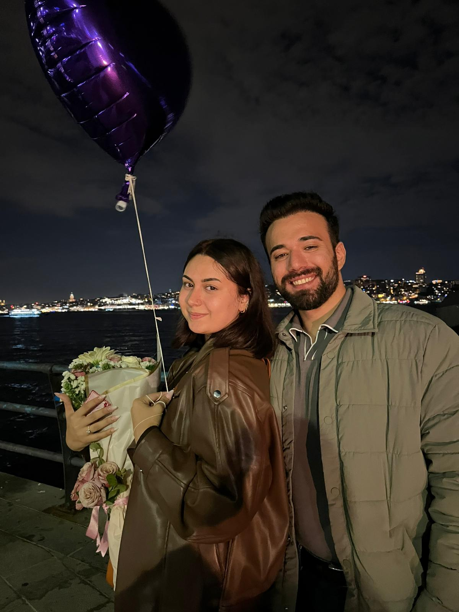
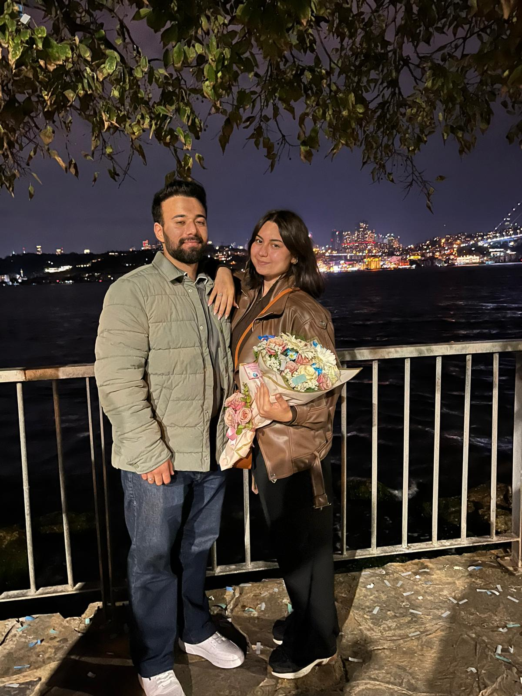
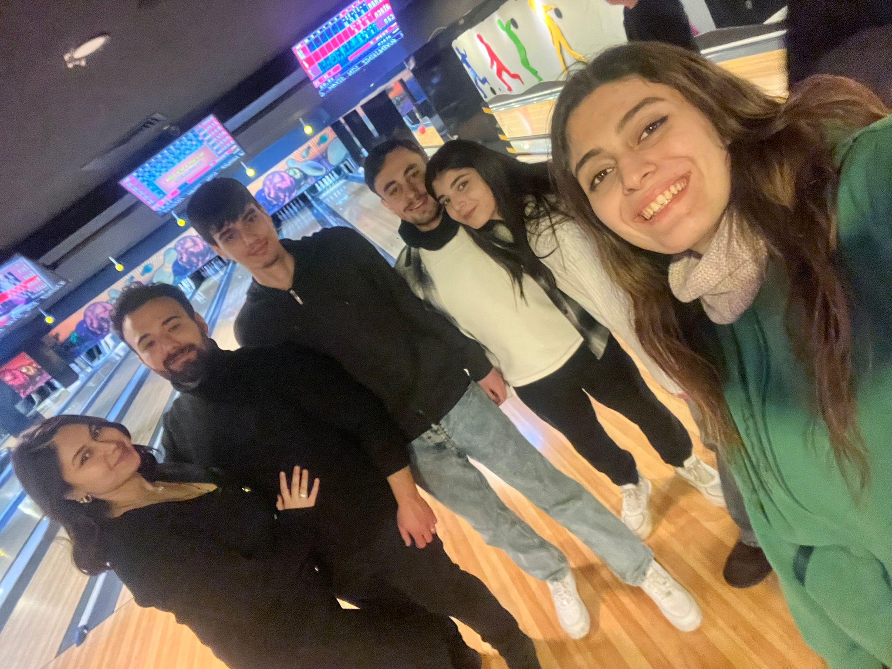
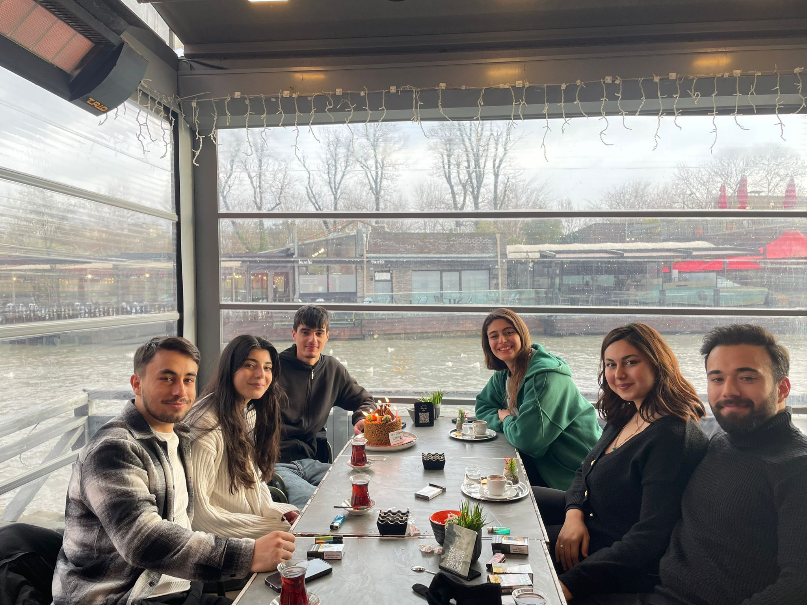
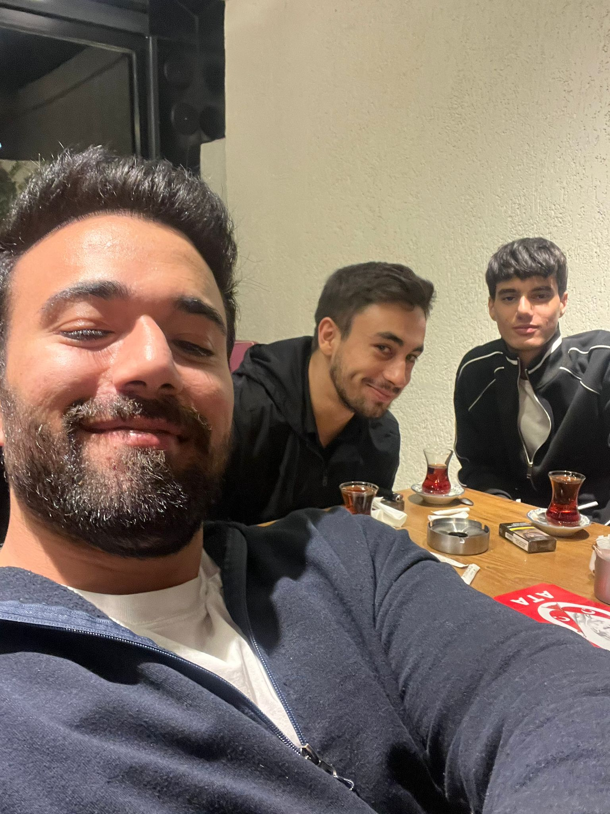
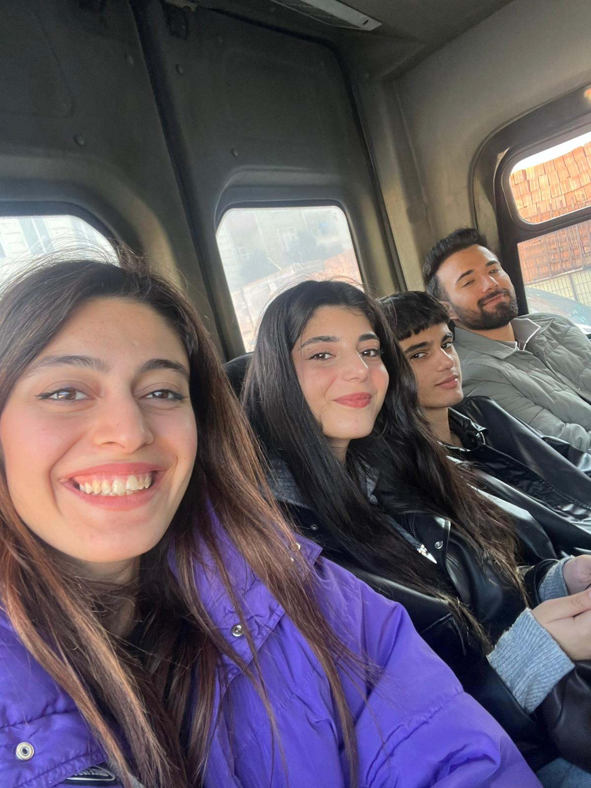

<!DOCTYPE html>
<html lang="tr">
<head>
<meta charset="UTF-8">
<meta name="viewport" content="width=device-width, initial-scale=1.0">
<title>İyi ki Doğdunuz 🎉</title>

</head>

<body>

<canvas id="effects"></canvas>

  <h1>🎉 İyi ki Doğdunuz 🎉</h1>

  

    

      
      

        Doğum gününüz kutlu olsun 
        Mutluluklar dilerim 💖
      

    

    

      
      

        Doğum gününüz kutlu olsun 
        Mutluluklar dilerim 💖
      

    

  

  <h2>📸 Anı Köşesi</h2>

  

    
    
    
    
  

<footer>Hazırlayan Yasin Şahin</footer>

  

</body>
</html>
